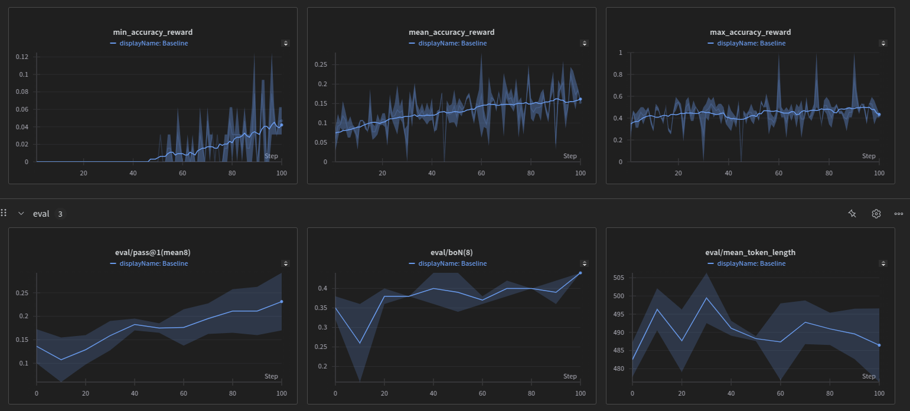

> **_NOTE:_**  This repository is a work in progress. Changes and updates may occur as the project evolves.


# Distributed RL for LLM Fine-tuning

This repo contains code for distributed RL for fast and memory efficient LLM fine-tuning using [Unsloth](https://github.com/unslothai/unsloth), [Ray](https://github.com/ray-project/ray), and [vLLM](https://github.com/vllm-project/vllm).
Currently, it is configured for a simple math task, but can be extended to other tasks. 

## 🚀 Features
- Multi-GPU Training: Efficiently utilizes multiple GPUs for distributed RL-based fine-tuning.
- Memory-Efficient Fine-Tuning: Uses [Unsloth](https://github.com/unslothai/unsloth) for reduced memory footprint.
- Fast Inference: Leverages [vLLM](https://github.com/vllm-project/vllm) for high-throughput generation.
- Scalable Distributed RL: Implements [Ray](https://github.com/ray-project/ray) to orchestrate multi-GPU workloads.

### 🏗️ Architecture Overview
This repository employs [Ray](https://github.com/ray-project/ray) for distributed computing with the following components:
- Actors: Generate candidate responses in parallel across multiple GPUs.
- Learner: Updates the policy based on rewards (can also participate in generation to avoid idleness).
- Trainer: Orchestrates the entire training pipeline.
The system leverages [vLLM](https://github.com/vllm-project/vllm) for fast inference and [Unsloth](https://github.com/unslothai/unsloth) for memory-efficient fine-tuning, making it possible to train large language models with reinforcement learning on limited hardware. This architecture enables efficient multi-GPU utilization, significantly accelerating the training process.

<details>
<summary><h1>Setup</h1></summary>

Create a new conda environment and install the dependencies:
```bash
conda create --name distrl \
    python=3.11 \
    pytorch-cuda=12.1 \
    pytorch cudatoolkit xformers -c pytorch -c nvidia -c xformers \
    -y
conda activate distrl
```

Install the dependencies:
```bash
pip install -r requirements.txt
```

</details>


# Usage
After setting up the environment, you can run the distributed training with:
```bash
python train_distributed.py --run_name your_run_name --number_of_actors 2 --learner pg
```
You can customize various parameters:
- `--model`: The model to use (default: "unsloth/Qwen2.5-7B-Instruct-bnb-4bit")
- `--dataset`: The dataset to use (default: "HuggingFaceH4/MATH-500") If you use a different dataset make sure to adapt the reward function and make sure the dataset is formatted correctly.
- `--number_of_actors`: Number of actor GPUs (default: 2)
- `--batch_size`: Total batch size, will be split across all actors
- `--learner`: Learning algorithm to use, either "pg" (Policy Gradient) or "grpo" (Generalized Reward-Weighted Policy Optimization)
- `--learner_chunk_size`: Number of samples to generate by the learner. Can be zero, but then the learner is idle during generation.
- `--topk`: Number of top-k candidates to consider for training. As we can sample thousands of completions in parallel learning is not the bottleneck with topk we can subselect the best candidates to train on.

# Learner ALgorithms
Currently, we have implemented a vanilla Policy Gradient algorithm and GRPO.
| Algorithm | Description | Status |
|-----------|-------------|--------|
| Policy Gradient | Vanilla policy gradient implementation | ✅ Implemented |
| GRPO | Group Relative Policy Optimization ([1](https://arxiv.org/abs/2402.03300), [2](https://github.com/deepseek-ai/DeepSeek-R1/blob/main/DeepSeek_R1.pdf)) | ✅ Implemented |


<details>
<summary><h1>Performance Tests</h1></summary>

Policy gradient training (~2hours)



</details>

## TODO:
- Usually the bottleneck for RL with LLMs is the online data generation. However, with ray and vllm this is not a problem. Instead the bottleneck is now the learning as we can sample thousands of completions in parallel. *Can we parallelize the learning process?*
- Add more learner algorithms
- Make option to use w & w/o vllm
- Training becomes unstable with longer training, try to fix